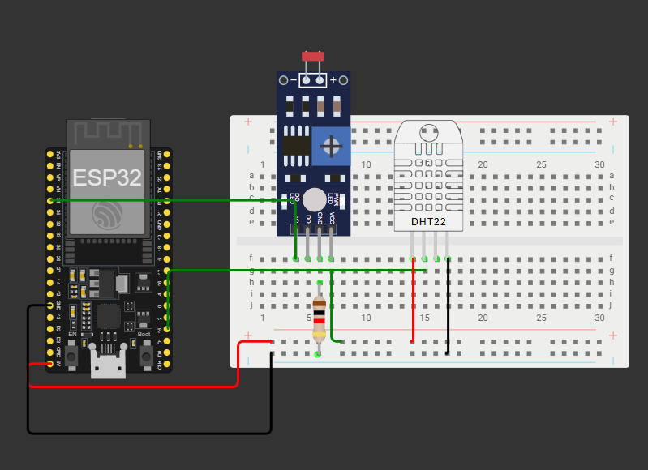

# Projeto de Monitoramento de Vinheria com FIWARE e ESP32

Este projeto implementa uma solução de IoT para o monitoramento em tempo real e histórico de sensores (temperatura, umidade e luminosidade) de uma vinheria, utilizando a plataforma FIWARE. A solução foi desenvolvida para o caso de estudo da "Vinheria Agnello".

## Arquitetura da Solução



**Fluxo de Dados:**
`Wokwi (ESP32)` -> `Mosquitto (MQTT Broker)` -> `IoT Agent for JSON` -> `Orion Context Broker` -> `STH-Comet`

---

## 1. Pré-requisitos

Antes de começar, garanta que você tenha os seguintes softwares instalados:

-   Uma máquina virtual (foi utilizada uma VM na Microsoft Azure).
-   Docker e Docker Compose.
-   Postman.

---

## 2. Instruções para Replicação do Projeto

Siga estes passos para configurar e executar o projeto em um novo ambiente.

### Fase 1: Configuração do Servidor FIWARE

1.  **Abra as portas no firewall** da sua VM. As seguintes portas TCP precisam estar abertas para acesso externo:
    -   `1883`: MQTT Broker (Mosquitto)
    -   `4041`: IoT Agent
    -   `1026`: Orion Context Broker
    -   `8666`: STH-Comet (Histórico de Dados)
2.  **Rode os seguintes comandos:** 
    ```
    sudo apt update

    sudo apt-get install net-tools

    ifconfig //Comando para pegar o IP

    sudo apt install git

    git clone https://github.com/fabiocabrini/fiware

    cd fiware

    sudo docker compose up -d

    sudo docker stats
    ``` 
4.  **Verifique se todos os contêineres estão rodando** e saudáveis (`healthy`):
    ```sh
    sudo docker ps
    ```

### Fase 2: Configuração do Dispositivo Simulado (Wokwi)

1.  Crie um novo projeto de ESP32 no Wokwi.
2.  Copie o conteúdo do arquivo `sketch.ino` para a aba do sketch no Wokwi (LEMBRE DE BAIXAR AS BIBLIOTECAS).
3.  Copie o conteúdo do arquivo `diagram.json` para a aba `diagram.json` no Wokwi.
4.  **ATENÇÃO:** No arquivo `sketch.ino`, altere a variável `mqtt_server` para o endereço IP público da sua máquina virtual.
    ```cpp
    const char* mqtt_server = "SEU_IP_PUBLICO_AQUI";
    ```
5.  Inicie a simulação e deixe-a rodando.

### Fase 3: Provisionamento e Verificação (Postman)

1.  Importe a coleção do Postman fornecida neste repositório https://github.com/fabiocabrini/fiware. 

2.  Execute as requisições na seguinte ordem, garantindo que sua simulação no Wokwi já esteja rodando.

3. Vale ressaltar que os nomes usados nos bodys dos JSONs podem ser diferentes, apenas coloquei estes por simplicidade.
---
#### **a) Criar Grupo de Serviço**

* **Objetivo:** Registrar a "chave de API" (`apikey`) `fiap` para permitir que o IoT Agent processe as mensagens MQTT do nosso dispositivo.
* **Método:** `POST`
* **URL:** `http://{{IP_publico_da_sua_maquina_virtual}}/iot/services`

* **Body (JSON):**
    ```json
    {
        "services": [
            {
                "apikey": "fiap",
                "cbroker": "http://orion:1026",
                "entity_type": "Vinheria",
                "resource": "/iot/d"
            }
        ]
    }
    ```
---
#### **b) Provisionar Dispositivo**

* **Objetivo:** Registrar nosso sensor específico no FIWARE, definindo seus atributos e o protocolo de comunicação (JSON).
* **Método:** `POST`
* **URL:** `http://{{IP_publico_da_sua_maquina_virtual}}/iot/devices`

* **Body (JSON):**
    ```json
    {
        "devices": [
            {
                "device_id": "teste",
                "entity_name": "Vinheria:teste",
                "entity_type": "Vinheria",
                "transport": "MQTT",
                "protocol": "IoTA-JSON",
                "attributes": [
                    { "object_id": "t", "name": "temperature", "type": "Float" },
                    { "object_id": "h", "name": "humidity", "type": "Float" },
                    { "object_id": "l", "name": "luminosity", "type": "Integer" }
                ]
            }
        ]
    }
    ```
---
#### **c) Verificar Dados ao Vivo**


* **Objetivo:** Confirmar que os dados do Wokwi estão chegando em tempo real no Orion Context Broker.
* **Método:** `GET`
* **URL:** `http://{{IP_publico_da_sua_maquina_virtual}}/v2/entities/Vinheria:teste`
---
#### **d) Criar Subscrição para Histórico**

* **Objetivo:** Criar a regra no Orion para que ele notifique o STH-Comet sempre que um dado do sensor for atualizado, salvando assim o histórico.
* **Método:** `POST`
* **URL:** `http://{{IP_publico_da_sua_maquina_virtual}}/v2/subscriptions`

* **Body (JSON):**
    ```json
    {
        "description": "Salvar historico da Vinheria no STH-Comet",
        "subject": {
            "entities": [
                {
                    "id": "Vinheria:teste",
                    "type": "Vinheria"
                }
            ]
        },
        "notification": {
            "http": {
                "url": "http://sth-comet:8666/notify"
            },
            "attrs": ["t", "h", "l"],
            "attrsFormat": "legacy"
        }
    }
    ```
---
#### **e) Verificar o Histórico**


* **Objetivo:** Consultar os dados salvos ao longo do tempo no STH-Comet para provar que a rastreabilidade está funcionando.
* **Método:** `GET`
* **URL:** `http://{{IP_publico_da_sua_maquina_virtual}}/STH/v1/contextEntities/type/Vinheria/id/Vinheria:teste/attributes/t?lastN=10`

* ***Observação:*** *Lembre-se de esperar pelo menos 1 minuto após criar a subscrição para que os dados sejam acumulados.*